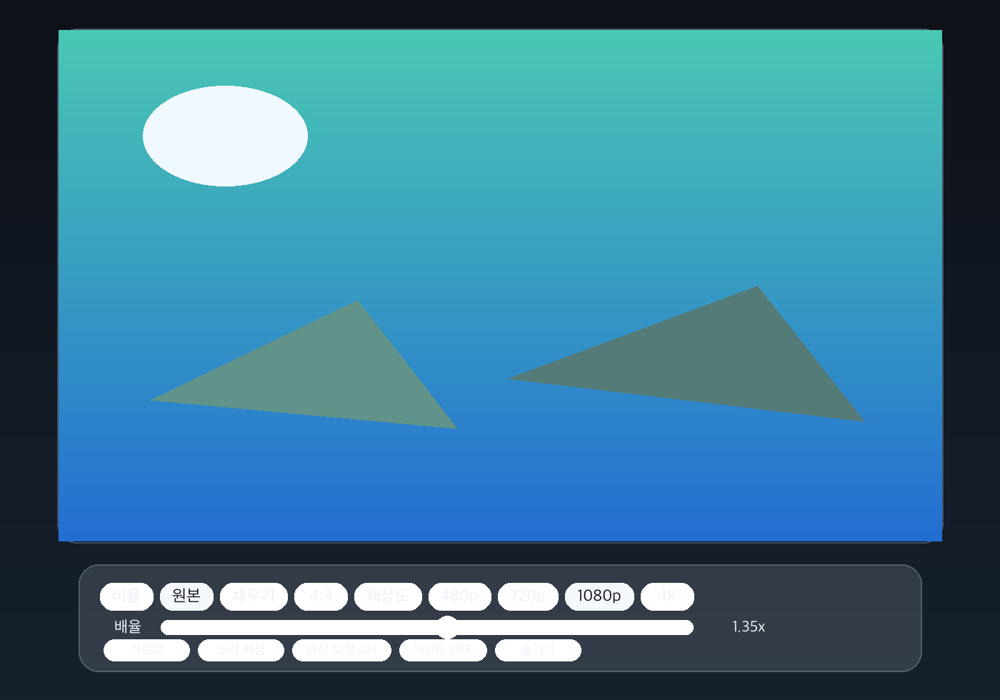
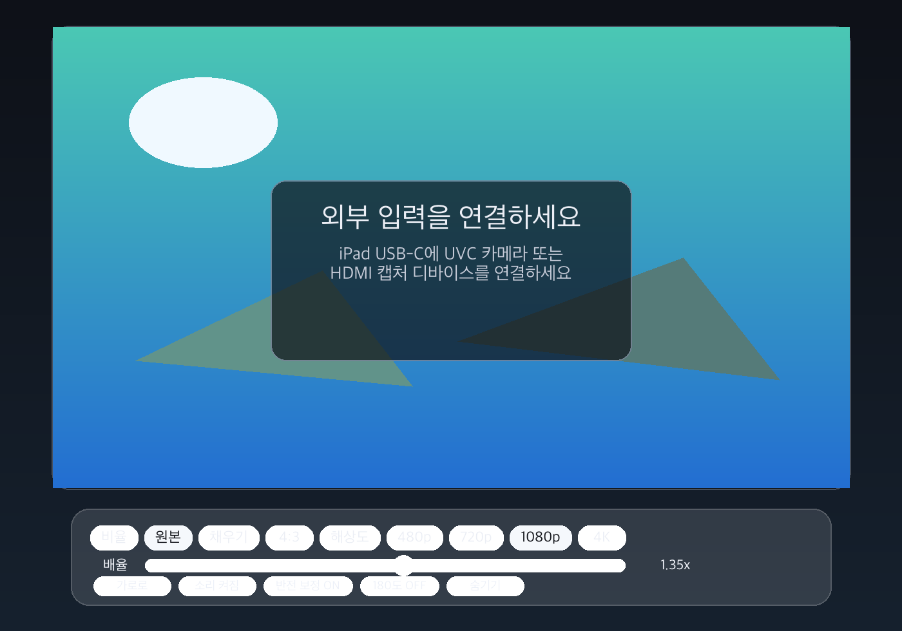
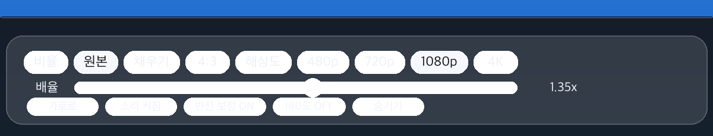
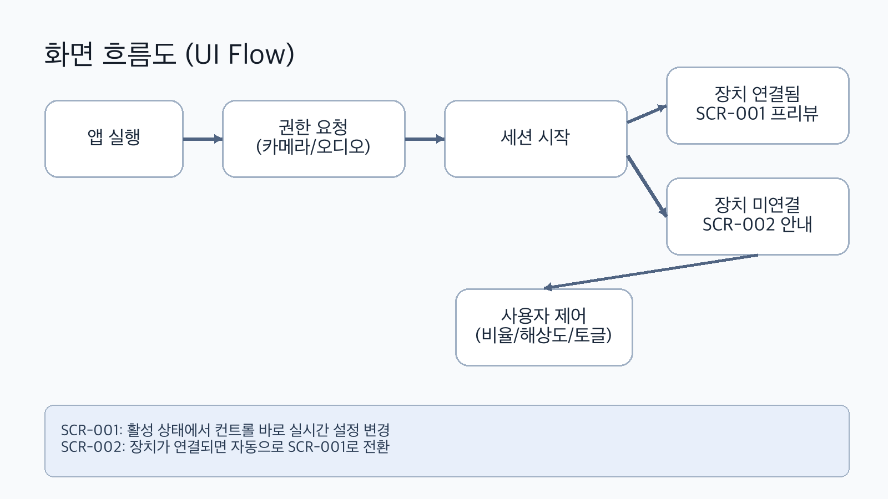

# 화면 정의서 (UI Spec)

- 회사명: 모모스테이지 엔터테이먼트
- 담당부서: 서비스개발팀
- 담당자: 안장현
- 현재 문서 버전: v1

## 1. 화면 구조
| 화면 ID | 화면명 | 설명 |
|---|---|---|
| SCR-001 | 프리뷰 화면 | 외부 입력 영상 + 하단 컨트롤 바 |
| SCR-002 | 미연결 안내 상태 | 장치 미연결 시 안내 오버레이 |

## 2. 화면 시안 (소스 기반 생성 이미지)

### SCR-001 프리뷰 화면

### SCR-002 장치 미연결 상태

### 컨트롤 바 상세

### 화면 흐름도

## 3. SCR-001 상세 정의
### 3.1 구성요소
| 컴포넌트 ID | 이름 | 동작 |
|---|---|---|
| CMP-001 | 프리뷰 레이어 | 캡처 세션 영상 출력 |
| CMP-002 | 비율 선택 칩 | 원본/채우기/4:3/16:9/21:9 |
| CMP-003 | 해상도 선택 칩 | 480p/720p/1080p/4K |
| CMP-004 | 배율 슬라이더 | 0.5~3.0, step 0.05 |
| CMP-005 | 방향 토글 | 세로/가로 전환 |
| CMP-006 | 오디오 토글 | 소리 켜짐/꺼짐 |
| CMP-007 | 반전 보정 토글 | 좌우 반전 보정 ON/OFF |
| CMP-008 | 180도 토글 | 상하 회전 보정 |
| CMP-009 | UI 숨김 버튼 | 오버레이 숨김 |

### 3.2 상태값
| 상태 | 설명 |
|---|---|
| Loading | 권한 요청 및 세션 초기화 |
| Active | 장치 연결 + 프리뷰 렌더링 |
| Minimal | UI 숨김, 탭으로 복원 |

### 3.3 사용자 액션/결과
| 액션 | 결과 |
|---|---|
| 반전 보정 토글 ON/OFF | 좌우 순서가 즉시 반영 |
| 180도 토글 ON/OFF | 영상이 즉시 180도 회전/복귀 |
| 해상도 변경 | 세션 프리셋 재설정 |
| 배율 변경 | 화면 스케일 즉시 반영 + 저장 |

## 4. SCR-002 상세 정의
- 표시 조건: 외부 비디오 장치 미감지
- 안내 문구:
  - "외부 입력을 연결하세요"
  - "iPad USB-C에 UVC 카메라 또는 HDMI 캡처 디바이스를 연결하세요"
- 전환 조건: 장치 감지 즉시 SCR-001로 자동 전환

## 5. 플로우 규칙
1. 앱 실행
2. 카메라/오디오 권한 요청
3. 세션 시작
4. 장치 연결 여부 분기
5. SCR-001 또는 SCR-002 표시
6. 사용자 설정 변경 즉시 반영

## 6. 예외 처리
| 케이스 | 처리 |
|---|---|
| 권한 거부 | 프리뷰 시작 중단, 안내 필요 |
| 장치 분리 | 세션 입력 해제 + 미연결 안내 표시 |
| 지원 불가 해상도 | 가능한 프리셋으로 자동 폴백 |
